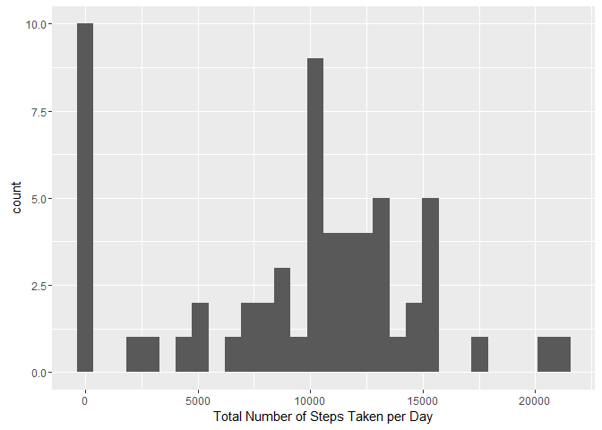

# Reproducible Research: Peer Assessment 1

## Loading and preprocessing the data

```r
unzip(zipfile="activity.zip")
```

```
## Warning in unzip(zipfile = "activity.zip"): error 1 in extracting from zip
## file
```

```r
activity_data <- read.csv("activity.csv")
```

## What is mean total number of steps taken per day?

```r
library(ggplot2)
```

```
## Warning: package 'ggplot2' was built under R version 3.2.5
```

```r
total_num_steps <- tapply(activity_data$steps, activity_data$date, FUN=sum, na.rm=TRUE)
qplot(total_num_steps, xlab="Total Number of Steps Taken per Day")
```

```
## `stat_bin()` using `bins = 30`. Pick better value with `binwidth`.
```

<!-- -->

```r
mean(total_num_steps, na.rm=TRUE)
```

```
## [1] 9354.23
```

```r
median(total_num_steps, na.rm=TRUE)
```

```
## [1] 10395
```

## What is the average daily activity pattern?

```r
library(ggplot2)
avg <- aggregate(x=list(steps=activity_data$steps), by=list(interval=activity_data$interval),
                      FUN=mean, na.rm=TRUE)
ggplot(data=avg, aes(x=interval, y=steps)) + geom_line() + xlab("5-minute interval") + ylab("average number of steps taken")
```

<!-- -->

On average across all the days in the dataset, the 5-minute interval contains
the maximum number of steps?

```r
avg[which.max(avg$steps),]
```

```
##     interval    steps
## 104      835 206.1698
```

## Imputing missing values


```r
missing_values <- is.na(activity_data$steps)
# How many missing
table(missing_values)
```

```
## missing_values
## FALSE  TRUE 
## 15264  2304
```

Replace all missing values with mean value for that specific 5-minute interval.


```r
filled_value <- function(steps, interval) {
    filled <- NA
    if (!is.na(steps))
        filled <- c(steps)
    else
        filled <- (avg[avg$interval==interval, "steps"])
    return(filled)
}
filled_data <- activity_data
filled_data$steps <- mapply(filled_value, filled_data$steps, filled_data$interval)
```
Create histogram of the total number of steps taken each day. Use the data to get the mean and median total number of steps.


```r
total_no_steps <- tapply(filled_data$steps, filled_data$date, FUN=sum)
qplot(total_no_steps, xlab="Total Number of Steps each Day")
```

```
## `stat_bin()` using `bins = 30`. Pick better value with `binwidth`.
```

<!-- -->

```r
mean(total_no_steps)
```

```
## [1] 10766.19
```

```r
median(total_no_steps)
```

```
## [1] 10766.19
```

The mean and median values are higher when including the missing data. This is because the total number of steps taken  is set to 0 on days where the value is NA by default. Removing these increases the mean and median values. 


## Are there differences in activity patterns between weekdays and weekends?

Find the day of the week for each measurement first:


```r
weekday.or.weekend <- function(date) {
    day <- weekdays(date)
    if (day %in% c("Monday", "Tuesday", "Wednesday", "Thursday", "Friday"))
        return("weekday")
    else if (day %in% c("Saturday", "Sunday"))
        return("weekend")
    else
        stop("date is not valid")
}
filled_data$date <- as.Date(filled_data$date)
filled_data$day <- sapply(filled_data$date, FUN=weekday.or.weekend)
```

Plot the average number of steps taken on weekdays and weekends.

```r
avg <- aggregate(steps ~ interval + day, data=filled_data, mean)
ggplot(avg, aes(interval, steps)) + geom_line() + facet_grid(day ~ .) +
    xlab("5-minute interval") + ylab("Number of Steps")
```

<!-- -->
